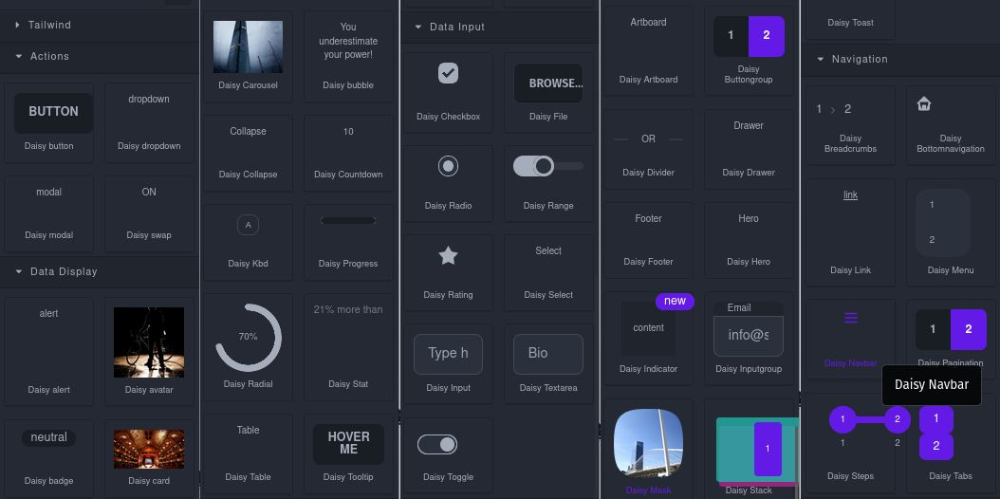

# Web/Mobile HTML Builder & Editor 🚀
### No-code HTML builder for your web and mobile apps based on [DaisyUI](https://daisyui.com/docs/install/) and [Tailwind](https://tailwindcss.com/docs).


## Quick start

```js
// Add component
domc.addType('daisy-button', {
  model: {
    defaults: {
      content: `button txt`, // inner HTML text
      // for UI modification
      traits: ['id', 'title', { label: 'Button text', type: 'text', name: 'content', changeProp: true }], 

      // <button>button txt</button>
      tagName: 'button',
      editable: true,

      // class='btn btn-neutral'
      attributes: { class: 'btn btn-neutral' }
    },
  },
  view: {

  },
});

// Use it in blocks.js
// defined from 'daisy-button' in components.js
bm.add('d-button', {
  category: 'Actions',
  name: 'd-button',
  label: 'Daisy button',
  content: { 
    type: 'daisy-button',
  },

  // HTML/SVG in the block manager
  media: '<button class="btn">button</button>',
});


```


## Summary
`TL;DR` Simply click ONLINE BUILDER and start building your HTML page.

-- Currently, to change components content click the component settings (cog wheel) then use this ugly hack: click "update" then add a character to the following input, then hit "tab" to update your component. 
Feel free to provide a better way --

Click the `</>` button to inspect and copy your HTML and CSS.
Paste code in your app and don't forget to add DaisyUI and Tailwind CSS in your html page, in the `header`:
```html
<link href="https://cdn.jsdelivr.net/npm/daisyui@2.38.1/dist/full.css" rel="stylesheet" type="text/css" />
    <link href="https://cdn.jsdelivr.net/npm/tailwindcss@2.2/dist/tailwind.min.css" rel="stylesheet" type="text/css" />
```
Auto-saves on your browser, no need to save!

## 🥰 PR are welcome!

If you'd like to contribute but don't want to download and install stuff, simply FORK this repository and change `blocks.js` and `components.js` in `src/`, then PR (Pull Request) from your fork to this project.

## Download

* CDN
  * `https://unpkg.com/web-mobile-html-builder`
* NPM (not sure)
  * `npm i web-mobile-html-builder`
* GIT
  * `git clone https://github.com/vocamen/web-mobile-html-builder.git`


## Development

Clone the repository

```sh
git clone --depth 1 https://github.com/vocamen/web-mobile-html-builder.git
cd web-mobile-html-builder
```

### Install dependencies

```sh
npm i
npm i -g grapesjs-cli
(you will need this one to test and build easily)
```

### Start the dev server

```sh
npx grapesjs-cli serve
```

### Tweak

Simply change 2 files in `src/`

* components.js (the HTML code in your page)
* blocks.js (the menu elements to drag in your HTML page)

### Build the source

```sh
npx grapesjs-cli build
```

### Test your project before PR
```sh
http-server ./dist/
```

## License

MIT
